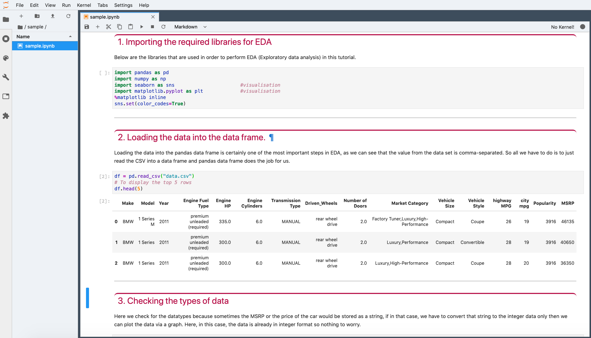

# jupyterlab-custom-theme

Colourful light theme for JupyterLab with vivid Python linting.
Updated to support JupyterLab 3.x.

## Screenshot


## Prerequisites

* JupyterLab >=3.0

## Install

From npm:
```
jupyter labextension install jupyterlab-custom-theme
```

## Development


To build the package and the JupyterLab app from source:

```bash
jlpm install
jlpm run build
jupyter labextension install .
jupyter lab build
```