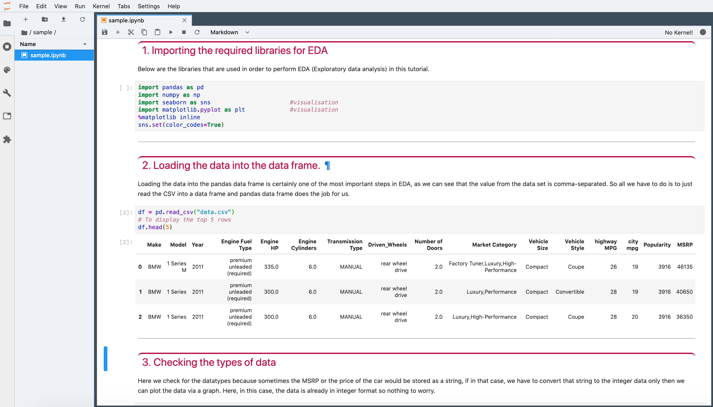

# jupyterlab-custom-theme

Colourful light theme for JupyterLab with vivid Python syntax highlighting.

## Screenshot



## Features

- Light theme with custom colour palette (petrol blue, neon, accent)
- Vivid Python syntax highlighting (CodeMirror-based)
- Colourful Markdown output styling (centred h1, coloured borders on h2–h4)
- Autoscroll outputs with max-height constraint
- Centred plot rendering (Matplotlib, etc.)

## Activate the theme

After installing the extension, select **Custom Theme** from
_Settings → Themes → JupyterLab Theme_.

## Prerequisites

- JupyterLab >= 4.5.0

## Install

### Via pip (recommended)

```bash
pip install jupyterlab-custom-theme
```

### Via npm

This package is also published to npm for use with JupyterLab's extension system:

```bash
npm install jupyterlab-custom-theme
```

Then select **Custom Theme** from _Settings → Themes → JupyterLab Theme_.

## Development

For a development installation:

```bash
# Clone the repository
git clone https://github.com/AlexBella365/jupyterlab_theme.git
cd jupyterlab_theme

# Install the JavaScript dependencies
jlpm install

# Build the extension
jlpm build

# Link your development version of the extension with JupyterLab
jupyter labextension develop . --overwrite
```

Alternatively, `make dev` performs the editable Python install and link in one step,
and `make reload` rebuilds and re-links after source changes.

You can watch the source directory and run JupyterLab at the same time in different terminals to watch for changes in the extension's source and automatically rebuild the extension.

```bash
# Watch the source directory in one terminal, automatically rebuilding when needed
jupyter labextension watch .

# Run JupyterLab in another terminal
jupyter lab
```

## Uninstall

```bash
pip uninstall jupyterlab-custom-theme
```

## Contributing

Contributions are welcome! Please feel free to submit a Pull Request.

## License

BSD 3-Clause License
